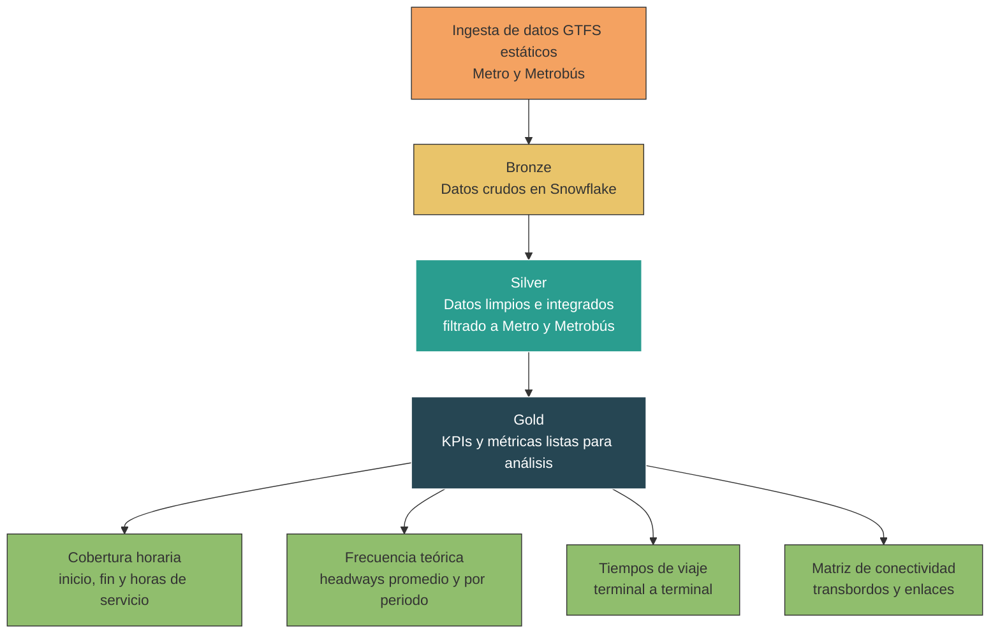
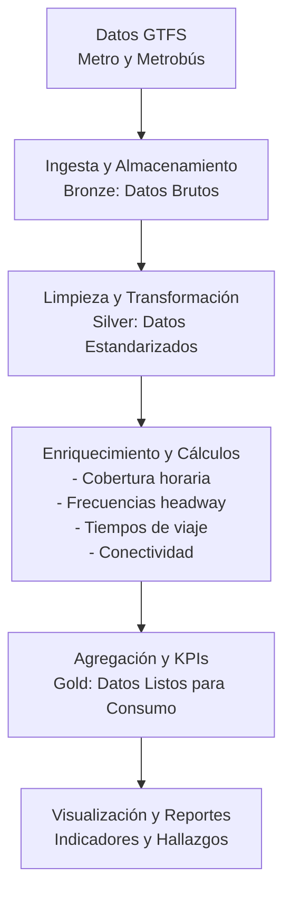
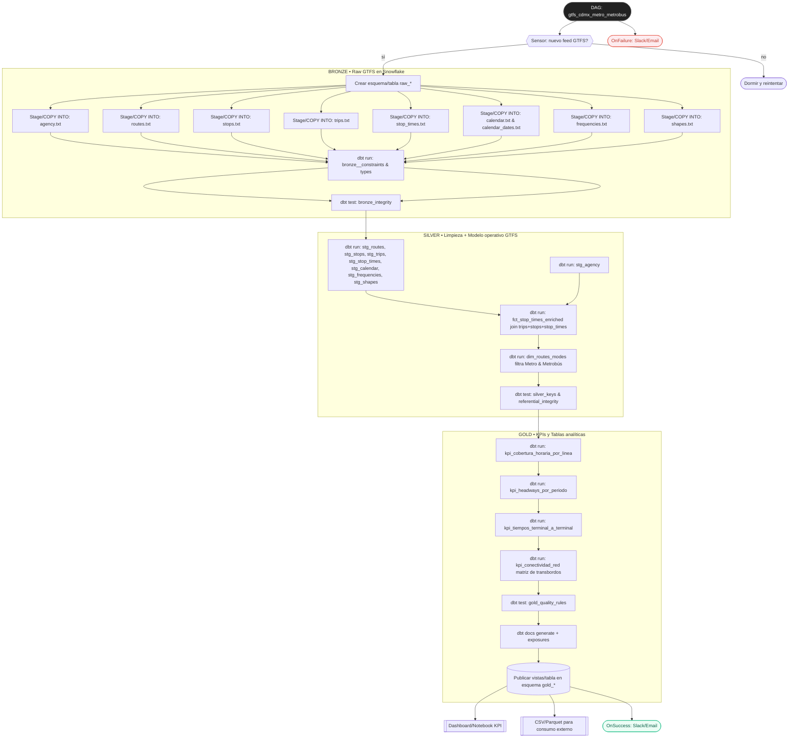
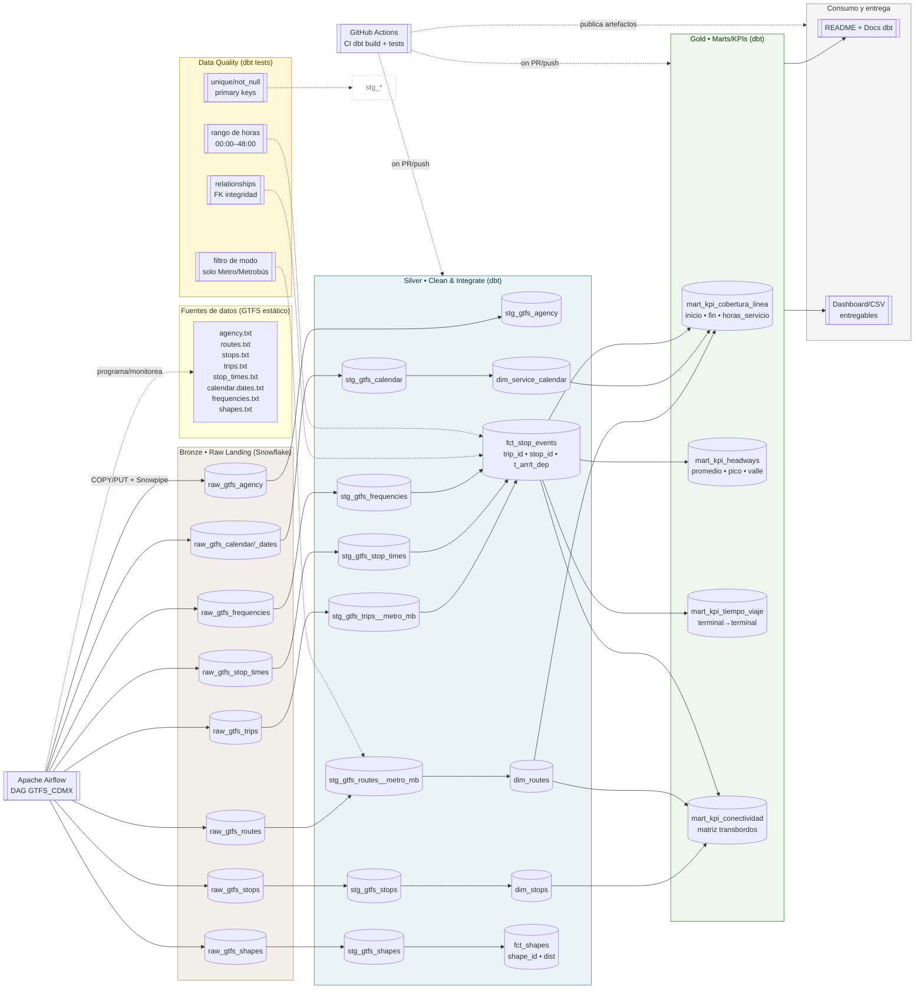

# DAG

```mermaid
graph TD
    A[Ingesta de datos GTFS estáticos<br>Metro y Metrobús] --> B[Bronze<br/>Datos crudos en Snowflake]
    B --> C[Silver<br/>Datos limpios e integrados<br/>filtrado a Metro y Metrobús]
    C --> D[Gold<br/>KPIs y métricas listas para análisis]

    D --> E1[Cobertura horaria<br/>inicio, fin y horas de servicio]
    D --> E2[Frecuencia teórica<br/>headways promedio y por periodo]
    D --> E3[Tiempos de viaje<br/>terminal a terminal]
    D --> E4[Matriz de conectividad<br/>transbordos y enlaces]

    style A fill:#f4a261,stroke:#333,stroke-width:1px
    style B fill:#e9c46a,stroke:#333,stroke-width:1px
    style C fill:#2a9d8f,stroke:#fff,stroke-width:1px,color:#fff
    style D fill:#264653,stroke:#fff,stroke-width:1px,color:#fff
    style E1 fill:#90be6d,stroke:#333,stroke-width:1px
    style E2 fill:#90be6d,stroke:#333,stroke-width:1px
    style E3 fill:#90be6d,stroke:#333,stroke-width:1px
    style E4 fill:#90be6d,stroke:#333,stroke-width:1px
```

```mermaid
flowchart TD
    %% Capa Bronze
    A[Datos GTFS<br>Metro y Metrobús] --> B[Ingesta y Almacenamiento<br>Bronze: Datos Brutos]

    %% Capa Silver
    B --> C[Limpieza y Transformación<br>Silver: Datos Estandarizados]
    C --> D[Enriquecimiento y Cálculos<br>- Cobertura horaria<br>- Frecuencias headway<br>- Tiempos de viaje<br>- Conectividad]

    %% Capa Gold
    D --> E[Agregación y KPIs<br>Gold: Datos Listos para Consumo]
    E --> F[Visualización y Reportes<br>Indicadores y Hallazgos]

```

```mermaid
flowchart TD
  %% ===== DAG metadata =====
  A0([DAG: gtfs_cdmx_metro_metrobus]):::meta --> A1{{Sensor: nuevo feed GTFS?}}
  classDef meta fill:#222,color:#fff,stroke:#555,stroke-width:1px;

  %% ===== Ingesta (Bronze / raw) =====
  subgraph BRONZE[BRONZE • Raw GTFS en Snowflake]
    direction TB
    B1[Crear esquema/tabla raw_*] --> B2[Stage/COPY INTO: agency.txt]
    B1 --> B3[Stage/COPY INTO: routes.txt]
    B1 --> B4[Stage/COPY INTO: stops.txt]
    B1 --> B5[Stage/COPY INTO: trips.txt]
    B1 --> B6[Stage/COPY INTO: stop_times.txt]
    B1 --> B7[Stage/COPY INTO: calendar.txt & calendar_dates.txt]
    B1 --> B8[Stage/COPY INTO: frequencies.txt]
    B1 --> B9[Stage/COPY INTO: shapes.txt]
    B10[dbt run: bronze__constraints & types] --> B11[dbt test: bronze_integrity]
  end

  %% Enlace sensor -> bronze
  A1 -- sí --> B1
  A1 -- no --> Z0([Dormir y reintentar])

  %% ===== Transformación (Silver / cleaned & modeled) =====
  subgraph SILVER[SILVER • Limpieza + Modelo operativo GTFS]
    direction TB
    S1[dbt run: stg_routes, stg_stops, stg_trips, stg_stop_times, stg_calendar, stg_frequencies, stg_shapes]
    S2[dbt run: stg_agency]
    S3[dbt run: fct_stop_times_enriched join trips+stops+stop_times]
    S4[dbt run: dim_routes_modes filtra Metro & Metrobús]
    S5[dbt test: silver_keys & referential_integrity]
  end

  %% ===== Capa de negocio (Gold / KPIs) =====
  subgraph GOLD[GOLD • KPIs y Tablas analíticas]
    direction TB
    G1[dbt run: kpi_cobertura_horaria_por_linea]
    G2[dbt run: kpi_headways_por_periodo]
    G3[dbt run: kpi_tiempos_terminal_a_terminal]
    G4[dbt run: kpi_conectividad_red matriz de transbordos]
    G5[dbt test: gold_quality_rules]
    G6[dbt docs generate + exposures]
    G7[(Publicar vistas/tabla en esquema gold_*)]
  end

  %% ===== Orquestación y dependencias =====
  B2 & B3 & B4 & B5 & B6 & B7 & B8 & B9 --> B10 --> B11 --> S1
  S1 & S2 --> S3 --> S4 --> S5 --> G1
  G1 --> G2 --> G3 --> G4 --> G5 --> G6 --> G7

  %% ===== Salidas =====
  G7 --> OUT1[[Dashboard/Notebook KPI]]
  G7 --> OUT2[[CSV/Parquet para consumo externo]]

  %% ===== Fallas y alertas =====
  classDef alert fill:#FDECEF,stroke:#E74C3C,color:#C0392B;
  classDef ok fill:#ECFDF5,stroke:#10B981,color:#065F46;
  F1([OnFailure: Slack/Email]):::alert
  F2([OnSuccess: Slack/Email]):::ok

  A0 --> F1
  G7 --> F2
```

## Data Pipeline

```mermaid
flowchart LR
  %% --------- Fuentes ----------
  subgraph FUENTE["Fuentes de datos (GTFS estático)"]
    GTFS[agency.txt\nroutes.txt\nstops.txt\ntrips.txt\nstop_times.txt\ncalendar.dates.txt\nfrequencies.txt\nshapes.txt]
  end

  %% --------- Orquestación ----------
  AFW[[Apache Airflow\nDAG GTFS_CDMX]]
  AFW -.programa/monitorea.-> GTFS

  %% --------- Bronze ----------
  subgraph BRZ["Bronze • Raw Landing (Snowflake)"]
    style BRZ fill:#f2efe9,stroke:#b98d5b,color:#333
    b_agency[(raw_gtfs_agency)]
    b_routes[(raw_gtfs_routes)]
    b_stops[(raw_gtfs_stops)]
    b_trips[(raw_gtfs_trips)]
    b_stoptimes[(raw_gtfs_stop_times)]
    b_calendar[(raw_gtfs_calendar/_dates)]
    b_freq[(raw_gtfs_frequencies)]
    b_shapes[(raw_gtfs_shapes)]
  end

  AFW -->|COPY/PUT + Snowpipe| b_agency
  AFW --> b_routes
  AFW --> b_stops
  AFW --> b_trips
  AFW --> b_stoptimes
  AFW --> b_calendar
  AFW --> b_freq
  AFW --> b_shapes

  %% --------- Silver ----------
  subgraph SLV["Silver • Clean & Integrate (dbt)"]
    style SLV fill:#eaf4f6,stroke:#2a7f97,color:#09343f
    stg_agency[(stg_gtfs_agency)]
    stg_routes[(stg_gtfs_routes__metro_mb)]
    stg_stops[(stg_gtfs_stops)]
    stg_trips[(stg_gtfs_trips__metro_mb)]
    stg_stoptimes[(stg_gtfs_stop_times)]
    stg_calendar[(stg_gtfs_calendar)]
    stg_freq[(stg_gtfs_frequencies)]
    stg_shapes[(stg_gtfs_shapes)]

    dim_routes[(dim_routes)]
    dim_stops[(dim_stops)]
    dim_service[(dim_service_calendar)]
    fct_stop_events[(fct_stop_events\ntrip_id • stop_id • t_arr/t_dep)]
    fct_shapes[(fct_shapes\nshape_id • dist)]
  end

  b_agency --> stg_agency
  b_routes --> stg_routes
  b_stops --> stg_stops
  b_trips --> stg_trips
  b_stoptimes --> stg_stoptimes
  b_calendar --> stg_calendar
  b_freq --> stg_freq
  b_shapes --> stg_shapes

  stg_routes --> dim_routes
  stg_stops --> dim_stops
  stg_calendar --> dim_service
  stg_trips --> fct_stop_events
  stg_stoptimes --> fct_stop_events
  stg_freq --> fct_stop_events
  stg_shapes --> fct_shapes

  %% --------- Tests de Calidad (dbt) ----------
  subgraph QA["Data Quality (dbt tests)"]
    style QA fill:#fff7d6,stroke:#b59b2c,color:#4d4200
    t_keys[[unique/not_null\nprimary keys]]
    t_refs[[relationships\nFK integridad]]
    t_ranges[[rango de horas\n00:00–48:00]]
    t_filters[[filtro de modo\nsolo Metro/Metrobús]]
  end
  t_keys -.-> stg_*:::ghost
  t_refs -.-> fct_stop_events
  t_ranges -.-> fct_stop_events
  t_filters -.-> stg_routes

  classDef ghost fill:none,stroke-dasharray: 3 3,stroke:#bbb,color:#777;

  %% --------- Gold ----------
  subgraph GLD["Gold • Marts/KPIs (dbt)"]
    style GLD fill:#edf7ed,stroke:#2f7d31,color:#143015
    kpi_cobertura[(mart_kpi_cobertura_linea\ninicio • fin • horas_servicio)]
    kpi_headway[(mart_kpi_headways\npromedio • pico • valle)]
    kpi_viaje[(mart_kpi_tiempo_viaje\nterminal→terminal)]
    kpi_conect[(mart_kpi_conectividad\nmatriz transbordos)]
  end

  dim_routes --> kpi_cobertura
  dim_service --> kpi_cobertura
  fct_stop_events --> kpi_cobertura
  fct_stop_events --> kpi_headway
  fct_stop_events --> kpi_viaje
  dim_stops --> kpi_conect
  dim_routes --> kpi_conect
  fct_stop_events --> kpi_conect

  %% --------- Consumo / Salidas ----------
  subgraph OUT["Consumo y entrega"]
    style OUT fill:#f5f5f5,stroke:#888,color:#333
    docs[[README + Docs dbt]]
    viz[[Dashboard/CSV\nentregables]]
  end

  GLD --> viz
  GLD --> docs

  %% --------- CI/CD ----------
  GHA[[GitHub Actions\nCI dbt build + tests]]
  GHA -.on PR/push.-> SLV
  GHA -.on PR/push.-> GLD
  GHA -.publica artefactos.-> OUT
```
