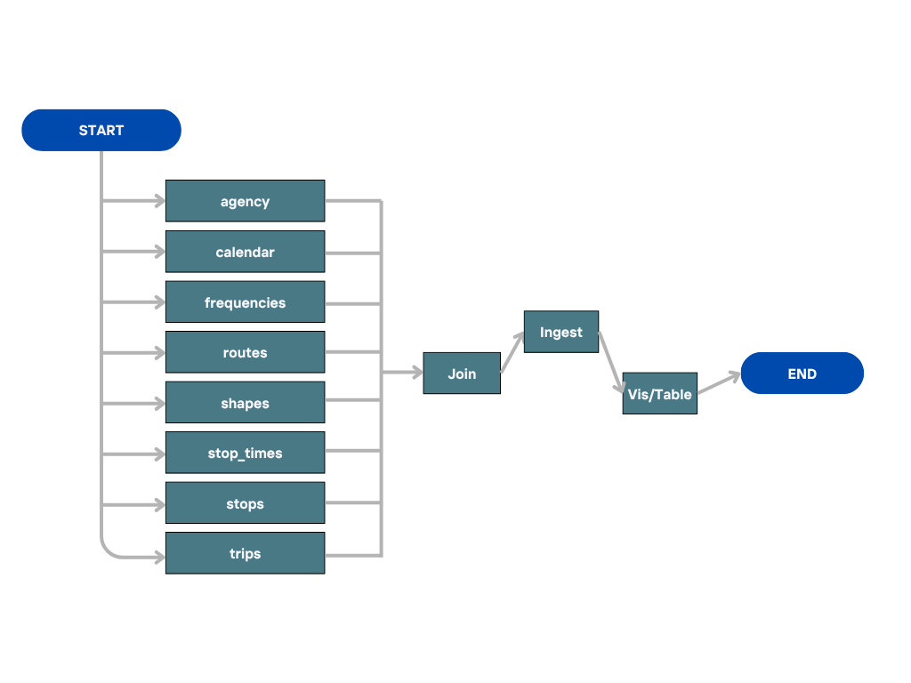
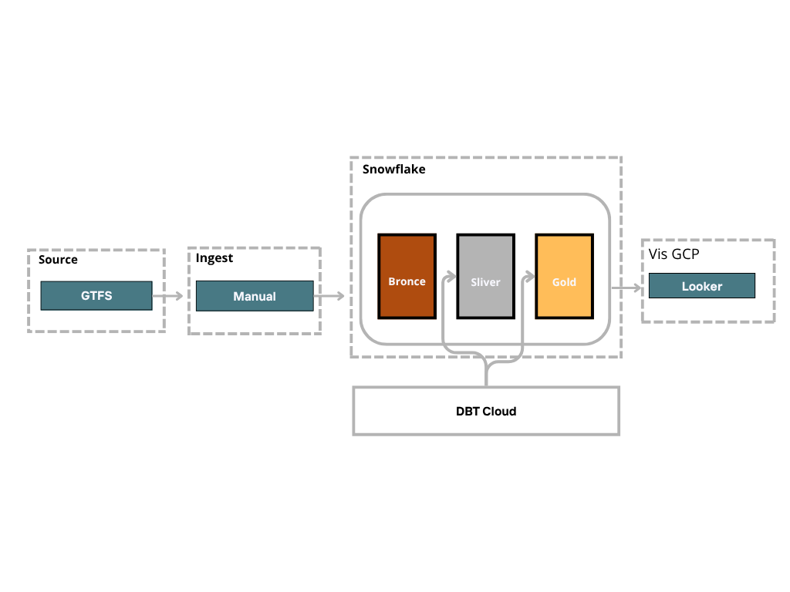

# Análisis de la Cobertura, Frecuencia y Conectividad del Metro y Metrobús de la CDMX mediante Datos GTFS Estáticos

## 1. Introducción

En la Ciudad de México, el **Metro** y el **Metrobús** son dos sistemas de transporte masivo fundamentales que movilizan millones de pasajeros diariamente. Evaluar la oferta teórica de servicio de estos sistemas —es decir, lo que indican sus horarios oficiales y programación— es clave para entender su alcance y eficiencia. La disponibilidad de datos abiertos en formato **GTFS estático** proporciona una oportunidad para analizar detalladamente esta oferta de servicio de manera consistente y reproducible.

Este proyecto de ingeniería de datos tiene como finalidad extraer y procesar datos estáticos GTFS del Metro y Metrobús de la CDMX para generar indicadores clave de desempeño. A través de estos datos, analizaremos la **cobertura horaria** (horas de inicio y fin de servicio por línea), los **intervalos teóricos entre vehículos** (frecuencias o *headways* programados), los **tiempos de viaje estimados** en cada ruta, y la **conectividad de la red** (cómo se interconectan las distintas líneas y estaciones). Todos estos indicadores se derivan de la información proporcionada por el estándar GTFS y nos permiten evaluar la robustez y alcance del servicio desde un punto de vista puramente programado (teórico).

La motivación detrás de este análisis es doble: por un lado, obtener *insights* operativos (por ejemplo, identificar rutas con amplios periodos sin servicio o con baja frecuencia teórica) y, por otro lado, ejercitar la construcción de un pipeline de datos profesional que siga buenas prácticas de la industria. Este documento detalla el plan de trabajo para llevar a cabo el proyecto, incluyendo sus objetivos, la arquitectura propuesta, las herramientas a utilizar y consideraciones para asegurar claridad, calidad y mantenibilidad en la solución.

## 2. Objetivos del Proyecto

Los objetivos principales de este proyecto son:

* **Analizar la oferta de servicio teórica del Metro y Metrobús de CDMX:** Obtener y calcular indicadores clave a partir de los datos GTFS estáticos, incluyendo:

  * *Cobertura horaria por línea:* Determinar el span de servicio de cada línea (hora de inicio y fin de operaciones, y total de horas de servicio por día).
  * *Frecuencias teóricas (headways):* Calcular los intervalos de paso programados promedio y por periodos (hora pico, valle, etc.) para cada línea, identificando la frecuencia teórica de los trenes/autobuses.
  * *Tiempos de viaje programados:* Estimar la duración de recorridos completos en cada línea (p.ej., tiempo de viaje de terminal a terminal) usando los horarios de paradas (*stop times*).
  * *Conectividad de la red:* Identificar puntos de transbordo entre líneas y construir una matriz de conectividad que refleje cómo un pasajero podría moverse de una línea a otra (directa o indirectamente), evaluando la integración del Metro y Metrobús como una sola red de transporte.
* **Diseñar e implementar una solución de ingeniería de datos robusta:** Construir un pipeline de datos modular y escalable que facilite la obtención de los indicadores anteriores de forma automatizada y reproducible. Esto incluye:

  * Integrar diversas herramientas y tecnologías siguiendo un esquema de **arquitectura medallion** (Bronze–Silver–Gold) para el manejo de los datos. En concreto, utilizar **Snowflake** como plataforma de almacenamiento y procesamiento de datos, **dbt** para las transformaciones (ETL/ELT) y **Apache Airflow** para la orquestación de las tareas, asegurando alineación con buenas prácticas.
  * Aplicar buenas prácticas de desarrollo de pipelines de datos: separación de capas (datos brutos vs. transformados vs. agregados), nomenclatura clara de objetos (por ejemplo, nombres descriptivos para tablas, modelos dbt y DAGs de Airflow), control de versiones del código (repositorio Git) y consideraciones de calidad de datos (pruebas unitarias o de calidad en dbt, validación de integridad referencial entre tablas, etc.).
* **Comunicar hallazgos y valor:** Presentar los resultados de manera entendible para terceros (evaluadores técnicos e interesados del bootcamp). Esto implica documentar claramente el proceso, justificar las decisiones técnicas tomadas y, eventualmente, visualizar o resumir los KPIs obtenidos para demostrar el valor del análisis. Un título y documentación claros, profesionales y alineados con el alcance del proyecto contribuirán a maximizar la comprensión y el impacto de este trabajo.

## 3. Alcance y Fuentes de Datos

Este proyecto se enfocará en los sistemas **Metro** y **Metrobús** de la Ciudad de México. Ambos sistemas cuentan con datos GTFS estáticos disponibles que describen sus operaciones programadas. El alcance comprende el análisis de las líneas activas de Metro (líneas 1 a 12) y de Metrobús (líneas 1 a 7, y línea 0 si existe un servicio especial) según los datos provistos en los feeds GTFS.

**Fuentes de datos:** Utilizaremos el conjunto de datos GTFS estático más actualizado disponible para la CDMX. Este feed, provisto por la Secretaría de Movilidad (SEMOVI) u otras entidades de la ciudad, incluye múltiples modos de transporte; filtraremos o extraeremos de él la información relevante únicamente a Metro y Metrobús. Los archivos fundamentales del feed GTFS que utilizaremos son:

* `agency.txt` (agencias operadoras, p.ej. STC Metro, Metrobús),
* `routes.txt` (definición de cada línea y sus atributos, como nombre y tipo),
* `stops.txt` (ubicaciones de estaciones y paradas),
* `trips.txt` (viajes programados que combinan una ruta con un horario específico),
* `stop_times.txt` (horarios de llegada y salida de cada viaje en cada parada, es el detalle de las secuencias de paradas),
* `calendar.txt` y `calendar_dates.txt` (días de operación de los servicios regulares y excepciones, como días festivos),
* `frequencies.txt` (intervalos de frecuencia especificados para servicios de tipo frecuencia en vez de horarios exactos, si aplica),
* `shapes.txt` (coordenadas para trazar la ruta en un mapa, útil para calcular distancias aproximadas de recorridos).

Estos archivos están relacionados mediante identificadores comunes (por ejemplo, `route_id`, `trip_id`, `stop_id`). A partir de ellos, podremos reconstruir los horarios completos de cada línea, las secuencias de estaciones y las frecuencias teóricas de servicio. La calidad de la fuente es crítica: asumimos que el GTFS está bien formado y sigue el estándar (por ejemplo, los tiempos de `stop_times` están ordenados, las referencias entre tablas son consistentes). En caso de encontrar datos faltantes o inconsistencias, se documentarán y manejarán en las etapas de transformación.

**Alcance temporal:** El GTFS estático representa la programación vigente en el momento de su publicación. Este análisis se centrará en un *período típico* (p.ej., un día laborable promedio) a menos que los datos incluyan variaciones entre días de la semana o excepciones. No se incorporarán datos en tiempo real ni variaciones históricas del servicio, pues la meta es evaluar la oferta planificada actual. Sin embargo, el pipeline se construirá de forma que pueda re-ejecutarse con nuevas versiones del GTFS (por ejemplo, si en el futuro se actualizan horarios o se agregan nuevas estaciones o líneas).

**Fuera de alcance:** Aspectos como demanda de pasajeros, puntualidad real del servicio o análisis de cumplimiento de la programación real no se abordan directamente, ya que requerirían datos adicionales (por ejemplo, GTFS-RT o registros de operación real). No obstante, en la sección de extensiones futuras se discuten posibles trabajos complementarios en esa línea.

## 4. Diseño de la Solución (Arquitectura de Datos)

### 4.1 Arquitectura de Capas (Bronze, Silver, Gold)

Para estructurar el flujo de datos de manera clara y escalable, se adopta la **arquitectura medallion** de tres capas: **Bronze**, **Silver** y **Gold**. Esta arquitectura permite mejorar progresivamente la calidad y la organización de los datos a medida que avanzan por cada capa, siguiendo principios ELT (Extract, Load, Transform):

* **Capa Bronze (Bronce - Datos Crudos):** En esta capa se ingieren los datos **sin transformar**, tal cual se obtienen de la fuente GTFS. Corresponde a la etapa de *landing* o *staging*. Se cargarán todos los archivos CSV del GTFS a tablas raw en Snowflake, preservando su estructura original. Los datos en Bronze pueden contener duplicados, formatos sin estandarizar (por ejemplo, campos de tiempo como texto) u otras imperfecciones, ya que no se alteran en esta etapa. El objetivo es conservar una copia fiel de los datos originales para referencia y posibles reprocesamientos.

* **Capa Silver (Plata - Datos Depurados y Enriquecidos):** En esta capa se limpian y transforman los datos integrándolos para su análisis. Las transformaciones a realizar incluyen: eliminar duplicados si los hubiera, convertir tipos de datos (por ejemplo, tiempos a formato datetime), crear columnas calculadas necesarias y unir tablas relevantes. **Importante:** Se mantiene el *mismo nivel de detalle (grain) que en Bronze*\*, pero con mejor calidad. Por ejemplo, se integrarán `trips`, `stop_times`, `stops` y `routes` para obtener una tabla consolidada de horarios por estación y por viaje, asegurando que cada registro esté completo y consistente. También se pueden filtrar los datos a solo Metro y Metrobús en esta capa si originalmente el GTFS contenía otros sistemas (como RTP, Trolebús, etc.), centrando así el dataset. En Silver, los datos ya están listos para análisis directos o para derivar métricas, manteniendo integridad referencial entre todas las partes (p. ej., todos los `route_id` de Metrobus en `trips` tienen su correspondiente entrada en `routes`).

* **Capa Gold (Oro - Datos Curados para Análisis/Reporting):** Es la capa final donde se almacenan los datos transformados **ya agregados o re-modelados** específicamente para responder a las preguntas del análisis. Aquí crearemos tablas de métricas y reportes listos para consumir. Por ejemplo, una tabla de **KPIs por línea y día** que contenga, para cada línea de Metro y Metrobús, su hora de inicio de servicio, hora de fin, span total de servicio (horas), frecuencia promedio en hora pico y en hora valle, tiempo promedio de recorrido end-to-end, etc. Otra posible tabla gold es la **matriz de conectividad** entre líneas (o estaciones clave), representada de forma a facilitar consultas sobre cuántos transbordos requiere ir de una línea a otra. Los datos Gold son de la *más alta calidad* y están modelados típicamente en esquemas entendibles (p. ej., una tabla de hechos con granulación diaria por línea, y dimensiones como Línea, Estación, etc., si correspondiera). Esta capa es la que se usaría para visualizaciones o para entregar a los interesados no técnicos.

Este enfoque en capas asegura claridad: cada nivel tiene un propósito distinto y reduce la complejidad. Además, permite reusar las capas inferiores si se requieren nuevos análisis (por ejemplo, si en el futuro se quisieran otras métricas, se podría partir de Silver sin tener que re-extraer todo). La división Bronze/Silver/Gold está alineada con las buenas prácticas recomendadas en entornos de **Snowflake, dbt** y otras plataformas modernas. En Snowflake, implementaremos cada capa en un esquema separado dentro de una misma base de datos de proyecto (por ejemplo: `GTFS_BRONZE`, `GTFS_SILVER`, `GTFS_GOLD`) para una segregación lógica clara de las tablas de cada etapa.



### 4.2 Implementación Tecnológica y Herramientas

A continuación se detalla cómo se emplearán **Airflow, Snowflake y dbt** en la realización de cada etapa del pipeline, así como otras herramientas de soporte:

* **Apache Airflow (Orquestación):** Airflow se encargará de coordinar y automatizar las tareas desde la extracción de datos hasta la generación de los productos finales. Se construirá un DAG (Directed Acyclic Graph) principal denominado, por ejemplo, `dag_cdmx_gtfs_pipeline` (nombre tentativo más descriptivo que simplemente "dag1" o "proyecto\_final") que ejecutará las siguientes tareas en orden:

  1. *Descarga o Ingesta del GTFS:* Si el feed GTFS está disponible vía URL o API, Airflow primero descargará el archivo zip y lo almacenará temporalmente. Alternativamente, si los archivos GTFS están localmente disponibles (como en este caso de trabajo), esta tarea simplemente obtendrá los archivos fuente necesarios. (En un entorno productivo, aquí podría integrarse una verificación de si hay una versión nueva del GTFS antes de proceder a la carga).
  2. *Carga a capa Bronze:* Utilizando un operador adecuado (por ejemplo, un **SnowflakeOperator** o scripts Python que usen el conector de Snowflake), el DAG cargará cada archivo .txt del GTFS a tablas en Snowflake, dentro del esquema Bronze. Se aprovecharán las capacidades de Snowflake para ingestión de archivos CSV (stages, COPY INTO, etc.) para eficientar esta tarea. Tras esta carga, tendremos tablas raw como `GTFS_BRONZE.stops`, `GTFS_BRONZE.trips`, etc. listas.
  3. *Ejecución de transformaciones dbt (Silver & Gold):* Una vez los datos crudos estén en Snowflake, se disparará una tarea que ejecute los modelos de **dbt** correspondientes a las capas Silver y Gold. Es decir, Airflow llamará a `dbt run` (posiblemente segmentado por tags o por modelo) para materializar las transformaciones definidas. Dentro del proyecto dbt, tendremos modelos SQL que crean las tablas Silver (p.ej., modelos staging para cada archivo raw aplicando limpieza de tipos, y modelos intermedios para unir datos relevantes) y modelos para las tablas Gold (cálculo de KPIs agregados, etc.). Airflow se encargará de monitorear que el comando dbt finalice con éxito. En caso de error (por ejemplo, un fallo en una prueba de calidad de datos en dbt), Airflow lo registrará y alertará.
  4. *Validación y finalización:* Opcionalmente, se puede incluir una tarea de *data quality check* posterior, que verifique que las tablas Gold no estén vacías, o que ciertos valores críticos (p.ej., que ninguna línea tenga span de servicio 0, o que las frecuencias calculadas estén en rangos razonables) se cumplan. Esto añade confianza en que el pipeline produjo resultados correctos. Tras esto, el DAG terminará. Se programará la ejecución del DAG según necesidad: dado que el GTFS estático no cambia diariamente, podría programarse una ejecución manual o mensual/trimestral cuando se actualicen los datos, en lugar de diaria.

* **Snowflake (Almacenamiento y Procesamiento):** Snowflake actuará como el *data warehouse* donde residirán las tablas en cada capa. La elección de Snowflake se debe a su capacidad de manejar de forma eficiente datasets estructurados, separar almacenamiento y cómputo y su compatibilidad con herramientas como dbt. En cuanto a *buenas prácticas en Snowflake*, además de la separación por esquemas para Bronze/Silver/Gold mencionada, se seguirán recomendaciones como:

  * Uso de **etiquetado claro** en los objetos: por ejemplo, prefijos en los nombres de tablas o vistas si aplica (aunque al estar en distintos esquemas, los nombres de tabla pueden mantenerse iguales a los originales en Bronze para fácil referencia, y nombres más analíticos en Gold).
  * **Manejo de esquemas dedicados de stage:** posiblemente utilizar *stages externos* o internos para la carga de archivos CSV. Snowflake permite definir un *stage* (área de staging interna o externa) para acceder al archivo GTFS zip. En nuestro caso, dado que podríamos cargar desde el sistema local, podríamos utilizar la opción de subir el archivo a una *etapa interna* y luego usar comandos `COPY INTO` para llenar Bronze. Esto garantiza reproducibilidad y registra en Snowflake la fuente de los datos.
  * **Optimización de recursos:** dado que se trata de un proyecto de volumen manejable (los datos GTFS de una ciudad no suelen ser masivos), se puede usar un *warehouse* pequeño de Snowflake y habilitar el auto-suspend para optimizar costos. También, al orquestar con Airflow, se puede hacer que el warehouse escale o active sólo en las ventanas de carga y transformación.
  * **Seguridad y roles:** si bien en un contexto de bootcamp quizás se use un usuario único, se mencionará brevemente que en producción se delimitarían roles (un rol de carga con acceso sólo a Bronze, rol de transformación con acceso a Silver/Gold, etc.) para limitar el alcance de operaciones, siguiendo las buenas prácticas de Snowflake en entornos colaborativos.

* **dbt (Transformaciones de Datos):** El núcleo de las transformaciones SQL residirá en un proyecto **dbt**. Se opta por dbt porque facilita la organización de modelos SQL en capas, permite refactorizar transformaciones complejas en pasos manejables y ofrece capacidades de pruebas y documentación automatizada. En la estructura de dbt:

  * Se tendrán modelos *staging* (Bronze a Silver) quizás denominados con prefijo `stg_` o dentro de una carpeta `models/staging`. Estos modelos tomarán las tablas raw de Snowflake (vía definiciones de **sources** en dbt) y aplicarán limpieza y cast de tipos. Por ejemplo, un modelo `stg_stop_times.sql` podría seleccionar de `GTFS_BRONZE.stop_times` convirtiendo los campos de hora de texto a tipo **TIME** o **TIMESTAMP**, ajustando formatos de fecha, etc.
  * Modelos intermedios (Silver) que unen datos: Por ejemplo, `model trips_enriched.sql` que combine viajes con sus tiempos de parada y con las rutas, produciendo un dataset detallado con todas las paradas de cada viaje con horarios absolutos. Aquí se puede incorporar la lógica para calcular, por cada viaje, cosas como: hora de primera salida, hora de última llegada, duración del viaje, número de paradas, etc., lo cual servirá después para agregaciones.
  * Modelos finales (Gold) en carpeta `models/marts` o similar. Aquí podríamos tener, por ejemplo, `fact_servicio_linea.sql` donde por cada combinación de línea (ruta) y día de la semana (o tipo de día: laboral/festivo) se calcule: primera salida del día, última salida, total horas de servicio, frecuencia media en hora pico, frecuencia media en resto del día, viajes totales programados en el día, etc. Esta tabla fact resumen responderá directamente a KPIs del proyecto. Otro modelo final podría ser `dim_estacion_conectividad.sql` o alguna vista/materialización que contenga para cada estación qué líneas pasan por ella, facilitando derivar la matriz de conectividad.
  * **Pruebas y documentación:** dbt permite definir pruebas (tests) simples, por ejemplo asegurando que campos clave no sean nulos, que los identificadores sean únicos donde deben serlo, o que ciertas relaciones entre tablas existan (p. ej., cada trip tenga una ruta válida en la tabla de rutas). Implementaremos pruebas especialmente en la capa Silver para garantizar integridad (por ejemplo, test de unicidad de `stop_id` en stops, test de no nulo en tiempos, etc.). También se documentarán los modelos usando los *docs* de dbt, de forma que quede constancia de qué hace cada modelo y qué campos expone, lo cual es útil para los evaluadores o cualquier desarrollador que revise el proyecto.
  * Vale resaltar que dbt facilita la lógica modular: en vez de una sola consulta SQL gigante, tendremos modelos encadenados (`ref()` de dbt) que hacen el proceso más legible y mantenible. Esto refleja buenas prácticas en la transformación de datos, haciendo el flujo más transparente.

* **Otros:** Python se empleará en puntos específicos, principalmente en la etapa de ingestión (p. ej., para descargar el archivo GTFS si es mediante URL, o para desempaquetar el zip y quizás preprocesar algo si fuera necesario). No obstante, la mayor parte de la lógica de negocio de transformación se mantendrá en SQL (via dbt) dentro de Snowflake, lo que aprovecha la potencia del motor de base de datos y sigue una filosofía ELT. Adicionalmente, si surgiera la necesidad de cálculos complejos fuera del alcance de SQL estándar (por ejemplo, cálculo de rutas más cortas para conectividad, etc.), se evaluaría incorporarlos con Python ya sea dentro de Snowflake (procedimientos almacenados en Python, Snowpark) o por fuera exportando ciertos datos, pero esto solo si es estrictamente necesario. De momento, se prevé que SQL es suficiente para los KPIs planteados.



### 4.3 Esquema de Carpeta y Nomenclatura del Proyecto

La organización del proyecto seguirá una estructura clara que refleje las diferentes componentes y responsabilidades, facilitando que otros colaboradores (o evaluadores) entiendan rápidamente dónde está cada cosa. A modo de propuesta, la estructura de directorios y archivos sería:

```
/Proyecto-CDMX-GTFS/
├── dags/
│   └── cdmx_gtfs_pipeline_dag.py        # Definición del DAG principal de Airflow
├── dbt/
│   ├── dbt_project.yml                 # Configuración del proyecto dbt
│   ├── profiles.yml                    # Perfil de conexión a Snowflake (gitignored probablemente)
│   └── models/
│       ├── staging/                    # Modelos de capa Bronze->Silver
│       ├── intermediate/               # Modelos de capa Silver (integración)
│       └── marts/                      # Modelos de capa Gold (fact y dim final)
├── data/
│   ├── gtfs_feed.zip                   # Archivo GTFS fuente (o podría mantenerse externamente y descargarse)
│   └── README_data.md                  # Notas sobre la fuente de datos, diccionarios, etc.
├── docs/
│   └── PlanDeTrabajo.md                # Documento de planificación (este documento refinado)
├── notebooks/                          # (Opcional) notebooks para exploración ad-hoc o visualización
├── requirements.txt                    # Listado de dependencias de Python (Airflow, dbt, etc.)
└── README.md                           # Descripción general del proyecto, instrucciones de uso
```

**Nomenclatura y convenciones:**

* *DAG de Airflow:* se ha optado por el nombre `cdmx_gtfs_pipeline_dag.py` para hacer evidente que el DAG gestiona el pipeline de datos GTFS de CDMX. Dentro de este archivo, el objeto DAG podría llamarse `cdmx_transit_pipeline`. Estos nombres descriptivos ayudan a identificar la función del flujo fácilmente en la interfaz de Airflow, en contraste con nombres genéricos. Si en el futuro hubiera múltiples DAGs (por ejemplo, uno para Metro y otro para Metrobús por separado), se nombrarían acorde a su alcance (`metro_gtfs_dag`, `metrobus_gtfs_dag`).
* *Models de dbt:* siguiendo convenciones comunes, los modelos de staging podrían llevar el prefijo `stg_` (ej: `stg_stops.sql`, `stg_trips.sql`) indicando que son básicamente replicaciones limpias de los raw. Los modelos intermedios podrían llevar nombres más descriptivos (`viajes_con_horarios.sql`, etc.) y los finales podrían tener prefijos como `fact_` para tabla de hechos o `dim_` para dimensiones/entidades de referencia. Por ejemplo, `fact_servicio_linea.sql` como mencionado, o `dim_estacion.sql` si preparamos una dimensión de estaciones consolidada con info de Metro vs Metrobus, etc. También se puede usar etiquetas o carpetas en dbt para materializar Silver vs Gold por separado, dependiendo de la preferencia (muchos dividen solo en staging y marts).
* *Esquemas en Snowflake:* ya detallado, usaremos esquemas `GTFS_BRONZE`, `GTFS_SILVER`, `GTFS_GOLD`. Dentro de Bronze, los nombres de tablas serán exactamente los del estándar (por claridad al mapear con los archivos: `stops`, `routes`, etc.). En Silver/Gold, los nombres de tablas/vistas resultantes reflejarán su contenido (por ejemplo, una tabla gold podría llamarse `SERVICIO_RESUMEN` o similar en mayúsculas, ya que Snowflake no distingue may/min en no quoted identifiers). Mantendremos consistencia en idioma: dado que los archivos GTFS vienen en inglés, en las capas brutas se conservan así, pero en las de métricas podríamos optar por nombres en español descriptivos, siempre documentándolos para evitar confusión.
* *Repositorio Git:* todo el código (Airflow DAG, proyecto dbt, scripts auxiliares, documentación) estará versionado. Se utilizarán *commits* atómicos y mensajes claros que indiquen qué cambio se realizó (por ejemplo, "Añade modelo dbt para cálculo de headways" en lugar de "cambios varios").

Esta estructura propuesta se inspira en la claridad de proyectos exitosos de ingeniería de datos, asegurando que cada componente esté bien delimitado. Facilita la colaboración (p. ej., alguien encargado de SQL sabe que debe ir a `dbt/models`, alguien revisando la orquestación irá a `dags/`, etc.) y la **mantenibilidad** a largo plazo.

## 5. Consideraciones sobre la Arquitectura Medallion y Buenas Prácticas

Dado que uno de los objetivos es alinear el proyecto con buenas prácticas, es oportuno revisar **cómo la arquitectura propuesta cumple con estándares reconocidos en la industria**:

* **Claridad del esquema Medallion:** La división en Bronze/Silver/Gold se ha delineado con roles específicos para cada capa, lo cual coincide con la filosofía de mejora incremental de la calidad de datos. La capa Bronze garantiza trazabilidad al origen (podemos siempre revisar qué datos originales produjeron un cierto resultado). Silver actúa como zona de consolidación y limpieza; aquí se deduplican datos y se estandarizan formatos, manteniendo el mismo nivel de detalle que Bronze. Gold ofrece datos listos para consumo, altamente condensados y en formas aptas para análisis rápido o presentación, equivalente a *data marts*. Esta progresión es compleja de lograr sin una separación clara: si hubiéramos intentado saltar directamente de crudo a métricas finales, el flujo sería más opaco y propenso a errores.
* **Snowflake – alineación con prácticas recomendadas:** Snowflake incentiva el uso de múltiples esquemas/bases de datos para aislar etapas del pipeline (en nuestro caso, esquemas por capa), lo cual implementamos. Además, aprovechamos funcionalidades nativas (staging de archivos, warehouses escalables) en lugar de reimplementarlas manualmente, enfocándonos en la lógica de negocio. La seguridad y control de costos están considerados (auto-suspend, minimizar retención de datos transitorios en Bronze después de uso, etc.). También, ubicar la mayor carga de transformación en Snowflake (que es altamente optimizado para SQL) sigue la tendencia actual de ELT sobre almacenamiento cloud.
* **dbt – buenas prácticas:** El plan de modelos sigue la recomendación de dbt de *staging vs intermediate vs marts* layers, evitando mezclas. Se utilizarán **sources** en dbt para referenciar las tablas raw de Snowflake, en lugar de codificar nombres de tablas directamente en los modelos, lo que mejora la configuración y permite detectar si faltan datos. Las pruebas integradas de dbt añaden una capa de seguridad para confiabilidad. Asimismo, al documentar modelos y utilizar materializaciones apropiadas (por ejemplo, vistas vs tablas según convenga en Silver vs Gold), se mantiene un equilibrio entre **rendimiento** y **costo** (no materializar tablas gigantes innecesariamente si una vista sirve, etc.). Dbt también facilita **reusabilidad**: por ejemplo, calcular la primera y última hora de servicio de un día para una ruta puede ser una subconsulta o modelo reutilizado tanto en la tabla de métricas por línea como en otros posibles análisis.
* **Airflow – buenas prácticas:** En la orquestación, seguimos la regla de no sobrecargar un solo operador con demasiada lógica: en lugar de un gigantesco script que haga todo, se separan responsabilidades en tareas discretas (descarga, carga, transformación, etc.), lo que hace el DAG más legible y *depurable*. Asimismo, se implementarán dependencias claras entre tareas (usando >> en la definición del DAG) para reflejar el flujo de datos correctamente. El DAG llevará argumentos razonables (p.ej., *retries* en caso de fallo transitorio de conexión, *alerts* vía email o Slack si se configura, etc.). La nomenclatura descriptiva del DAG y de las tasks dentro del DAG ayudará a que al visualizarlo en la UI de Airflow, cualquier persona entienda qué hace cada paso. Por ejemplo, tasks nombradas "fetch\_gtfs\_zip", "load\_bronze\_tables", "run\_dbt\_models", "run\_data\_quality\_checks", etc., en lugar de genéricos. Adicionalmente, se podría aprovechar la integración Airflow-dbt mediante hook u operador específico para dbt, simplificando la llamada a los modelos y posibilitando la captura de logs detallados de dbt en Airflow.
* **Mantenibilidad y extensibilidad:** La estructura modular permite que futuras modificaciones se integren sin refactorizar por completo. Si mañana quisiéramos agregar datos de otra fuente (ej: otro medio de transporte) o incluso integrar datos de uso real (GTFS-RT), podríamos añadir nuevas tareas al DAG y nuevos modelos dbt (quizá un nuevo schema *Bronze\_RT* y equivalentes Silver/Gold) sin interferir con lo ya construido. Esto es preferible a un diseño monolítico. También, el uso de control de versiones garantiza que cualquier mejora propuesta (como cambiar el grain de análisis, o ajustar un KPI calculado) quede registrada y pueda ser revisada por mentores o compañeros, fomentando colaboración y transparencia.

En resumen, el diseño técnico del proyecto está pensado para ser **claro**, **confiable** y **en línea con estándares profesionales**. Esto no solo facilita la evaluación actual en el contexto del bootcamp, sino que aporta valor práctico: la solución podría escalarse o adaptarse a casos reales con modificaciones mínimas, gracias a haber adoptado estas buenas prácticas desde la fase de planificación.

## 6. Resultados Esperados (KPIs y Productos)

Al completar la implementación, esperamos obtener los siguientes resultados concretos, que reflejan los objetivos de análisis planteados:

* **Tabla de Cobertura Horaria por Línea:** Un conjunto de resultados (por ejemplo, una tabla o vista **`ServicioPorLinea`**) donde cada registro corresponde a una línea del Metro o Metrobús en un tipo de día específico (día hábil, sábado, domingo, si sus horarios varían). Para cada registro se incluirán campos como: primera hora de salida del día (HH\:MM), última hora de servicio del día, *span* de servicio (en horas y minutos), número de viajes programados en ese día, etc. Esto permitirá identificar, por ejemplo, qué líneas operan más temprano o más tarde, y comparar la oferta diaria entre líneas.
* **Frecuencias Teóricas (Headways) por Periodo:** Métricas derivadas que podrían presentarse en forma tabular o gráfica, mostrando el intervalo promedio entre unidades por franja horaria. Por ejemplo, un resultado podría ser: *Línea 1 Metro – Headway medio en hora pico: 3 min; Headway medio en hora valle: 6 min*. Esto se calcula a partir de los horarios: contando cuántos vehículos salen en ciertas franjas. Posiblemente generaremos una tabla **`FrecuenciaTeorica`** con columnas de línea y periodo (p.ej. `am_peak`, `midday`, `pm_peak`, `night`) y valores de intervalo promedio o frecuencia por hora. Este KPI ayudará a entender la intensidad del servicio a lo largo del día y si hay brechas largas sin servicio.
* **Estimaciones de Tiempos de Viaje:** A partir de los datos de `stop_times.txt` y `trips.txt`, se deducirá el tiempo de recorrido completo de cada viaje (restando la hora de llegada final menos la hora de salida inicial en un trip). Con eso podremos calcular el tiempo promedio de viaje para cada línea (posiblemente diferenciando sentido, e.g. vuelta y retorno). El resultado podría ser: *Línea 2 Metro – tiempo promedio de terminal a terminal: 45 minutos*. Estos datos pueden integrarse a la tabla de *ServicioPorLinea* o en una tabla separada de **`TiemposDeRecorrido`**. Son útiles para dar contexto de la longitud de la línea y su desempeño teórico; también para futuros cálculos de velocidad promedio si se relacionan con la longitud (de `shapes.txt`).
* **Matriz o Lista de Conectividad de la Red:** Un producto clave sería una **matriz de conectividad** entre líneas, indicando cuán interconectadas están. Una forma de presentarlo es una tabla **`Transbordos`** donde cada fila es un punto de conexión (por ejemplo, una estación) listando qué líneas convergen allí. Otra forma es una matriz NxN (N líneas en total, Metro+Metrobús) donde la intersección (i,j) es 1 si la línea i conecta con la j directamente (comparten al menos una estación de transbordo) o 0 si no. También podríamos extender esa matriz para marcar conexiones indirectas con dos transbordos, etc., aunque probablemente con marcar las directas es suficiente para este alcance. El objetivo es visualizar, por ejemplo, que *Metro Línea 7* conecta con *Línea 2* y *Línea 3* a través de determinadas estaciones, y que el *Metrobús Línea 4* conecta con varias líneas de Metro en diferentes puntos, etc. Esto ilustra la integración modal: cuántas combinaciones de transbordo existen y si hay modos aislados. Un hallazgo podría ser identificar estaciones estratégicas (nodos centrales) con muchas conexiones. **Nota:** Este análisis dependerá de la información disponible; utilizaremos `transfers.txt` si existe en el feed (que explícitamente lista transbordos permitidos entre paradas), o en su defecto, deduciremos conexiones por proximidad o nombre de estación (con cuidado).
* **Informe o Dashboard (opcional):** Si el tiempo lo permite y se considera valioso, los resultados anteriores podrían integrarse en una visualización más amigable, como un pequeño dashboard. Por ejemplo, usando una herramienta gratuita (Google Data Studio/Looker Studio, Tableau Public, PowerBI, etc.) o incluso un notebook con gráficos, para mostrar: gráfica de barras de span de servicio por línea, mapa de la ciudad con todas las estaciones marcadas codificado por cuántas líneas pasan (mostrando nodos de conexión), etc. Esto no es un requerimiento explícito, pero entregaría mayor valor comunicativo. Dado que los profesores evaluadores pueden apreciar la claridad, podría adjuntarse capturas o breves ejemplos de tales visualizaciones en la documentación final.

Lo importante es que cada uno de estos productos debe estar respaldado por el pipeline reproducible. Es decir, no serán cálculos aislados en Excel o manualmente, sino salidas generadas por las transformaciones *Gold* en Snowflake. De esta forma, si el GTFS se actualiza o si se extiende el análisis a otro periodo, se pueden regenerar fácilmente. También asegura transparencia: si hay preguntas sobre cómo se llegó a cierto número (por ejemplo, "¿por qué la línea X tiene 18 horas de servicio?"), podemos rastrear en las tablas Silver los horarios de primera y última corrida que lo determinan.

## 7. Extensiones Futuras y Trabajo Complementario

Si bien el presente proyecto se limita al análisis de datos estáticos programados, es natural pensar en posibles ampliaciones o profundizaciones que podrían emprenderse más adelante para agregar valor adicional:

* **Incorporación de Datos en Tiempo Real (GTFS-RT):** Un paso evolutivo sería conectar este pipeline con feeds de datos en tiempo real para comparar la *oferta teórica* vs **la operación real**. Por ejemplo, recolectando datos de posición o estimaciones de arribo en tiempo real del Metro o Metrobús (si están disponibles públicamente) durante un período, se podría calcular el *headway real promedio* y contrastarlo con el teórico. Esto revelaría qué tan bien se cumplen los horarios, la puntualidad y regularidad del servicio. La arquitectura actual podría acomodar esto añadiendo una rama paralela de ingestión de GTFS-RT (quizá usando una cola de mensajes o consultas periódicas a una API) y generando métricas de cumplimiento (p.ej., % de intervalos que exceden lo programado). Esto sería de gran interés para evaluar la calidad del servicio desde el usuario.
* **Análisis de Capacidad y Demanda:** Con los datos de frecuencia teórica, se podría estimar la **capacidad teórica de transporte** por línea (asumiendo cierta capacidad por vehículo) y compararla con datos de demanda si se tuvieran (por ejemplo, aforos o conteos de validaciones de tarjeta). Este cruce, aunque fuera simple, ayudaría a identificar posibles saturaciones o ineficiencias (ejemplo: líneas con poca frecuencia pero alta demanda, o viceversa).
* **Extender a Otros Modos de Transporte:** El feed GTFS de la CDMX incluye otros sistemas (Cablebús, Trolebús, Tren Ligero, autobuses RTP, etc.). Sería interesante extender el análisis para tener un panorama multimodal completo de la ciudad. Nuestra infraestructura lo permite: solo requeriría incorporar esas agencias en los filtros y generar métricas similares para cada una. Esto podría dar un análisis comparativo: ¿qué modo ofrece mayor cobertura horaria? ¿Cuál tiene las mejores frecuencias? etc. Dado el tiempo limitado, esto se deja como futuro trabajo.
* **Refinamiento de la Conectividad - Red de Grafos:** La matriz de conectividad es un inicio, pero podríamos aplicar análisis de grafos a la red de transporte. Por ejemplo, calcular medidas de centralidad de estaciones (¿cuáles estaciones son más importantes en términos de conectividad?), rutas mínimas en la red de transbordos (¿cuántos transbordos en promedio se requieren para ir entre dos líneas cualesquiera?), o incluso optimizar recorridos. Esto sería un nivel analítico superior, posiblemente utilizando librerías como NetworkX en Python con los datos extraídos.
* **Optimización de Horarios (teórico):** Con los datos estructurados, un proyecto complementario podría ser sugerir mejoras en la oferta teórica. Por ejemplo, detectar si existen periodos largos sin servicio que podrían mejorarse, o si algunas líneas tienen tiempos de viaje muy largos que pudieran indicar ineficiencias operativas (tal vez divisibles en subrutas). Estas ideas ya entran en el terreno de consultoría de transporte, pero muestran cómo la base de datos creada puede servir de sustento para propuestas de mejora reales.

Cada una de estas extensiones requeriría esfuerzo adicional y posiblemente datos extra, pero están alineadas con el objetivo de **aprovechar la infraestructura de datos construida**. Lo valioso es que, tras finalizar el proyecto actual, queda un ecosistema de datos confiable sobre Metro y Metrobús que puede responder no solo las preguntas iniciales sino muchas otras que se formulen en adelante.

## 8. Conclusión

En este plan de trabajo se ha detallado un proyecto de ingeniería de datos enfocado en el análisis del Metro y Metrobús de la Ciudad de México usando datos GTFS estáticos. Se han definido claramente los objetivos analíticos (cobertura horaria, frecuencias, tiempos de viaje y conectividad) y los objetivos técnicos (construir un pipeline robusto en capas con Snowflake, dbt, Airflow). A través de un glosario técnico, se aclararon los términos clave para asegurar que tanto evaluadores técnicos como profesores del bootcamp comparten entendimiento sobre los conceptos fundamentales.

La arquitectura propuesta, basada en el esquema **Bronze–Silver–Gold**, refleja las buenas prácticas actuales de la industria, garantizando calidad y transparencia en el manejo de datos a lo largo del pipeline. La alineación con herramientas modernas (Snowflake, dbt, Airflow) no solo facilitará la implementación, sino que también expone a su autor a patrones de desarrollo profesional. Asimismo, se han incorporado mejoras sugeridas en cuanto a la nomenclatura clara de componentes, la estructuración del repositorio y la posibilidad de extender el proyecto a futuro, inspiradas en proyectos ejemplares de ELT de datos.

Al finalizar este proyecto, no solo se obtendrán métricas valiosas sobre el estado teórico de la oferta de transporte en la CDMX, sino que se habrá montado una solución replicable y mantenible. Esto aportará valor educativo en el contexto del bootcamp (demostrando competencias en ingeniería de datos de punta a punta) y valor práctico, pues los resultados podrían interesar a planificadores de transporte o al público curioso por entender cómo opera su ciudad.

En definitiva, **este proyecto, titulado "Análisis de la Cobertura, Frecuencia y Conectividad del Metro y Metrobús de la CDMX mediante Datos GTFS Estáticos"**, busca comunicar de manera sólida y profesional tanto el proceso seguido como el alcance y el valor de los hallazgos esperados, sentando un precedente de calidad para trabajos similares en el futuro.

**Referencias:**

* Datos GTFS estáticos de la Ciudad de México (Portal de Datos Abiertos).
* Wikipedia: *GTFS - General Transit Feed Specification* (información general sobre el estándar).
* MapaUrbano Blog: *Frecuencia e intervalo de paso* (definiciones de headway e implicaciones en transporte).
* Wikipedia: *Área de stage (datos)* (definición de zona staging en contexto ETL).
* Medium: *Implementing Medallion architecture in Snowflake* (discusión sobre capas Bronze, Silver, Gold en Snowflake).